# Вводный урок  
Тут будут описан первый урок, а также картинки и т.д.  

## Начало работы
- Заходим в Roblox Studio  
- Нажимаем New Experience
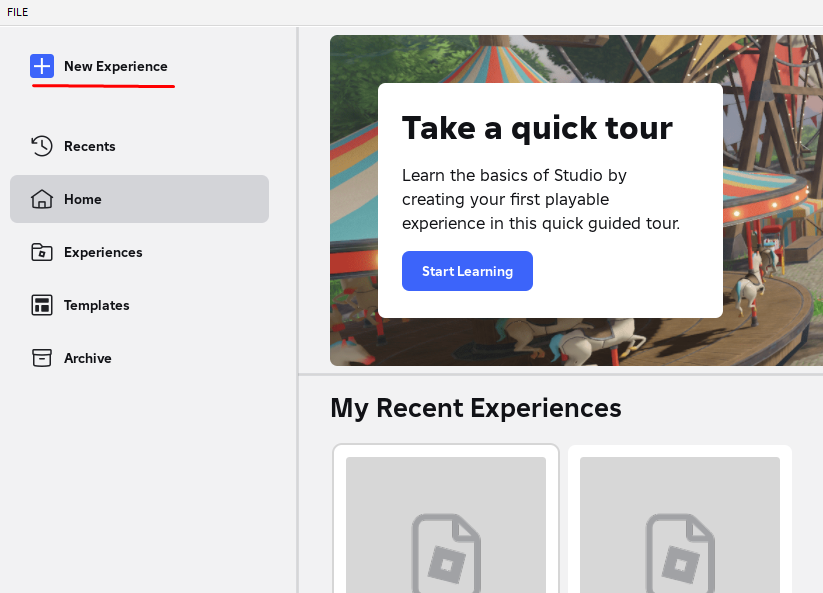

## Изучим окно
Теперь разберём из каких частей (рабочих областей) состоит окно Roblox Studio и для чего они нужны (разберём не всё и не сильно подробно)  
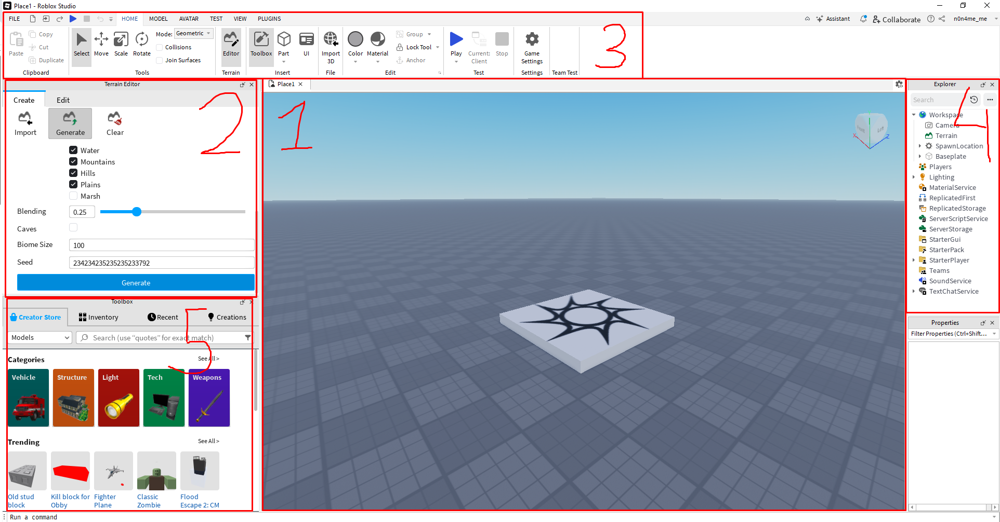
1. Это так называемая "сцена". С помощью этой сцены можно будет передвигаться по "миру" до запуска плейса, перемещать объекты и т.д.
2. Terrain Editor. Эта рабочая область нужна для того, чтобы создавать/генерировать/редактировать ландшафт.
3. Эта рабочая область состоит из разных полезных частей. Поподробнее дойдём попозже, но в кратце - это выбор инструментов, разные настройки проекта и т.д.
4. Explorer. Эта область показывает какие элементы/объекты есть в твоём проекте.
5. Toolbox. Тут находятся уже готовые объекты, которые можно использовать.

## Передвижение по сцене
Прежде чем мы начнём создавать мир, давай научимся по нему перемещаться.

Какие есть возможности?
- "W" - движение вперёд
- "S" - движение назад
- "A" - движение влево
- "D" - движение вправо
- "Q" - движение вниз
- "E" - движение вверх
- "Shift" - замедление передвижения
- "Зажать правую кнопку мыши" - возможность осматриваться
- "Зажать колёсико мыши" - ещё одна возможность перемещаться по сцене
- "Колёсико мыши вверх" - приближение к курсору
- "Колёсико мыши вниз" - отдаление от курсора

Пусть ученик попробует все эти возможности.

Также в верхнем правом углу можно заметить координатные оси (чем-то похоже на улучшенный компас), которые помогут ориентировтаься в пространстве.  
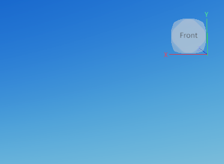

## Взаимодействие с объектами
Сейчас ученик может увидеть только один объект - это спавн игрока. С помощью левой кнопки мыши можно перемещать этот объект. Пусть ученик попробует.  
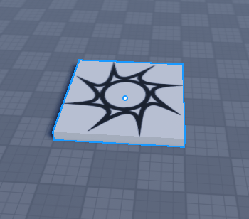

## Тестовый запуск
Попробуем запустить и побегать по миру.

Для того, чтобы сделать тестовый запуск, нужно нажать на синий треугольник с надписью "Play" в разделе "Test".
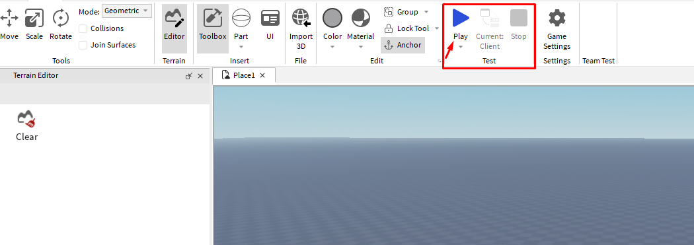

Тут скорее всего почти каждый ученик знает, как управлять, но для педагога (или если ученик играл только с телефона) опишу управление.
- "W", "A", "S", "D" - передвижение
- "Зажатие правой кнопки мыши" - управление камерой
- "Скролл колёсика мыши" - приближение/отдаление камеры
- "Space" - прыжок

Также есть интерфейс, но пока не думаю, что нужно на нём заострять внимание.
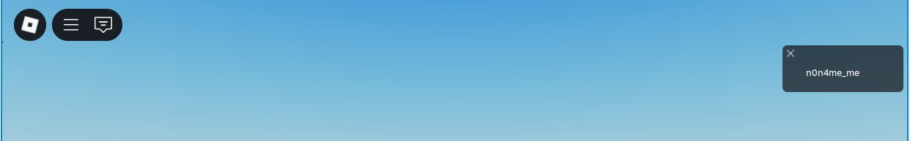

Чтобы прекратить тестовый запуск и вернутся к редактору нужно нажать на красный квадрат с надписью "Stop" в разделе "Test".
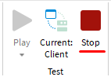

## Создание ландшафта
Мир пока что пустой - научимся его заполнять!

Начнём с создания ландшафта. Самое простое - сгенерировать. Для этого сначала нажмём на "Generate" в разделе "Terrain Editor"  

Теперь разберёмся в параметрах (настройках) генерации. Разбираем с учениками не всё, а смотрим по уровню. Точно затрагиваем "Size", "Position", "Biomes" (не подробно), "Caves" и кнопку "Generate". Остальное расписал для педагогов, а также, если сильные ученики будут.  
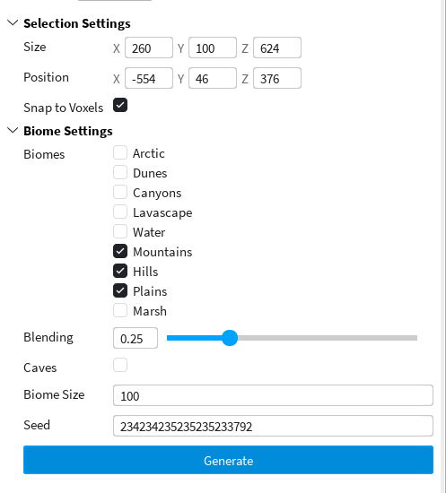  

- "Size" - размер создаваемого ландшафта
- "Position" - позиция создаваемого ландшафта
- "Snap to Voxels" - функция, которая позволяет объектам перемещаться и выравниваться по сетке вокселей, то есть по кубическим ячейкам фиксированного размера. Когда эта функция включена, объекты не могут быть размещены произвольно, а только в узлах этой сетки, что упрощает создание аккуратных и ровных структур
- "Biomes" - выбор биомов, которые будут использованы при генерации ландшафта
- "Blending" - инструмент, который позволяет создавать плавные переходы между различными типами ландшафта. Он используется для сглаживания границ между разными материалами ландшафта, такими как трава, песок, камень и вода, делая ландшафт более реалистичным и визуально приятным
- "Caves" - вкл/выкл генерации пещер
- "Biome Size" - размер биомов
- "Seed" - так называемое "семечко", если простым языком - правила генерации. Если более сложным - регулирует «шум» распределения элементов биома. Чем меньше значение, тем более резкие будут участки перехода ландшафта
- "Generate" - Кнопка для старта генерации

Можно поиграться с параметрами в зависимости уровня ученика и как вы идёте по уроку. Для примера - мои параметры
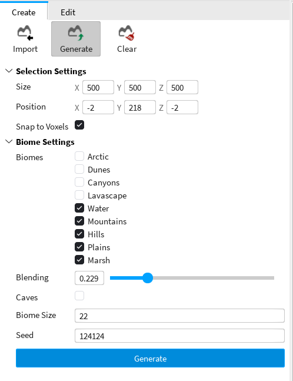  

Теперь можно побегать по этому ландшафту. Пробуем запустить и появляемся в "затекстурье". Можем спросить у ученика, как пофиксить - переместим точку спауна игрока в нужное место.
Если потеряли спаун, то можно его создать:  
- Переходим во вкладку "Model"
- Нажимаем на "Spawn"
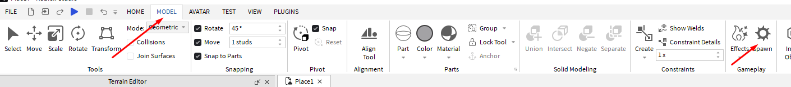  

Чтобы переместить спаун, там же во вкладке "Model" выбираем "Select" или "Move" и перемешаем в нужное место.
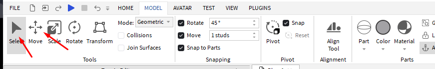  

И теперь запускаем и можно немного отдохнуть и побегать по созданному миру.  
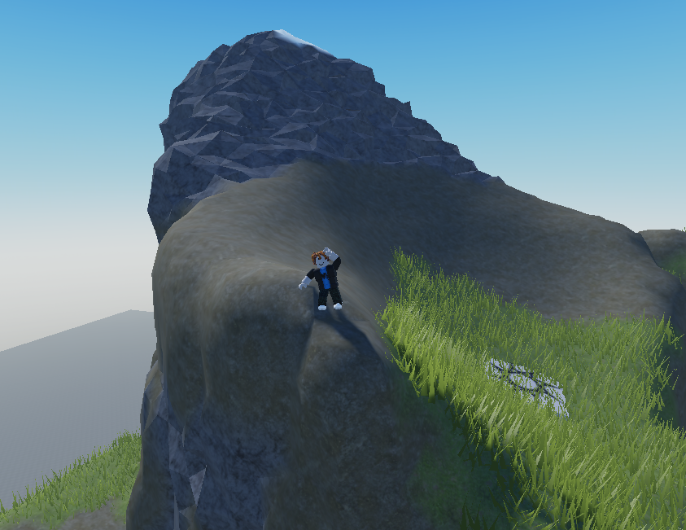  

## Редактирование ландшафта
А что, если хочется создать что-то своё и определённое или отредактировать уже сгенерированный ландшафт? Для этого в "Terrain Editor" есть вкладка "Edit".
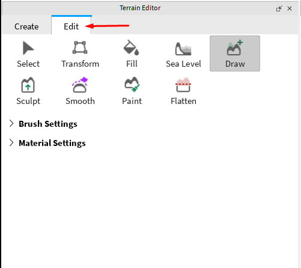  

Разберёмся, какие инструменты есть (Разбираем с учениками не всё, если не успевам, а просто показываем, ориентируемся по уровню ученика. Рекомендуемая очерёдность - "Draw", "Paint", "Sea Level", "Sculpt", "Select",  "Transform", "Fill", "Flatten", "Smooth"):
- "Select" - выделить область
- "Transform" - переместить/трансформировать выделенную область.
- "Fill" - заполнение выделенной области
- "Sea Level" - создать водную область
- "Draw" - рисовать/стирать ландшафт
- "Sculpt" - редактировать ландшафт, как пластелин/глину
- "Smooth" - гладкость ландшафта
- "Paint" - раскрашивание ландшафта/смена тесктуры ландшафта
- "Flatten" - выравнивание ландшафта

Пройдёмся по ним.

### Draw
Пробуем вместе с учеником воспользоваться этим инструментом.

Параллельно можно разобрать "Brush Settings" (тоже не всё, а что позволяет время):
- "Brush Mode" - Add(рисовать)/Subtract(удалять)
- "Brush Shape" - форма "кисти"
- "Brush Size" - размер "кисти"
- "Pivot Position" - точка опоры "кисти". Чтобы понять как это работает - лучше самостоятельно попробовать. Кисть работает в пространстве по разному и может пригодиться в некоторых ситуациях
- "Snapping" - как я понял - это привязка к вокселям. Более строго начинает рисовать/удалять, как бы по клеточкам
- "Plane Lock" - создаёт дополнительную сетку, которая помогает ровно "рисовать/удалять" ландшафт. Auto - автоматически, Manual - можно самостоятельно задать эту сетку
- "Ignore Water" - игнорирует воду при редактировании
- "Ignore Parts" - игнорирует объекты при редактировании

А также есть "Material Settings":
- "Auto Material" - самостоятельно подставляет материал в зависимости от окружения
- "Source Material" - выбор материала

### Paint
Пробуем вместе с учеником.

"Brush Settings":
Всё также, только нет "Brush Mode"

"Material Settings":
Вместо "Auto Material" добавилось "Material Mode" - при "Paint" меняет материал ландшафта, а при "Replace" появляется "Target Material", в которой выбирается на какой материал меняется, а "Source Material" - на какой материал это воздействует.

### Sea Level

### Sculpt

### Select

### Transform

### Fill

### Flatten

### Smooth

## Сохранение проекта
Пора научиться сохранять проект, чтобы всё творение оставалось и можно было вернуться к работе.

- Нажимаем "File"
- Нажимаем "Save File"

- Выбираем место куда сохранить
- Можно поменять название проекта
- Нажимаем сохранить
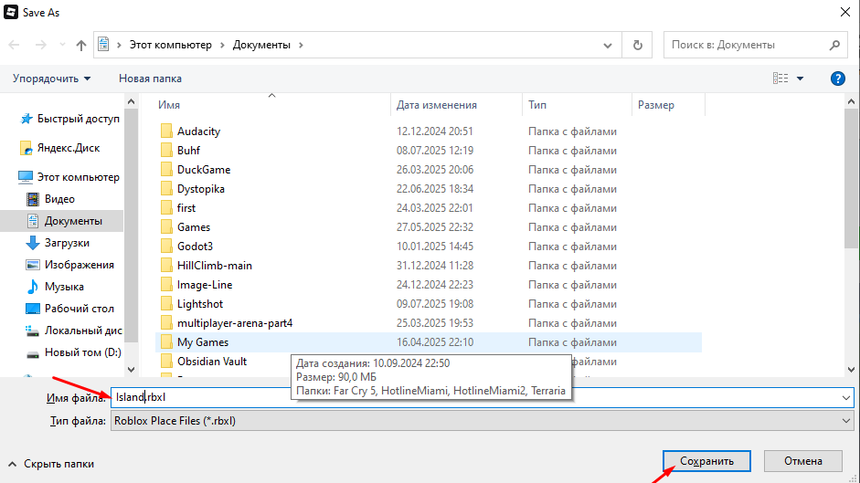  
