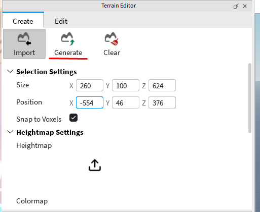

# Вводный урок  
Тут будут описан первый урок, а также картинки и т.д.  

## Начало работы
- Заходим в Roblox Studio  
- Нажимаем New Experience

## Изучим окно
Теперь разберём из каких частей (рабочих областей) состоит окно Roblox Studio и для чего они нужны (разберём не всё и не сильно подробно)  

1. Это так называемая "сцена". С помощью этой сцены можно будет передвигаться по "миру" до запуска плейса, перемещать объекты и т.д.
2. Terrain Editor. Эта рабочая область нужна для того, чтобы создавать/генерировать/редактировать ландшафт.
3. Эта рабочая область состоит из разных полезных частей. Поподробнее дойдём попозже, но в кратце - это выбор инструментов, разные настройки проекта и т.д.
4. Explorer. Эта область показывает какие элементы/объекты есть в твоём проекте.
5. Toolbox. Тут находятся уже готовые объекты, которые можно использовать.

## Передвижение по сцене
Прежде чем мы начнём создавать мир, давай научимся по нему перемещаться.

Какие есть возможности?
- "W" - движение вперёд
- "S" - движение назад
- "A" - движение влево
- "D" - движение вправо
- "Q" - движение вниз
- "E" - движение вверх
- "Shift" - замедление передвижения
- "Зажать правую кнопку мыши" - возможность осматриваться
- "Зажать колёсико мыши" - ещё одна возможность перемещаться по сцене
- "Колёсико мыши вверх" - приближение к курсору
- "Колёсико мыши вниз" - отдаление от курсора

Пусть ученик попробует все эти возможности.

Также в верхнем правом углу можно заметить координатные оси (чем-то похоже на улучшенный компас), которые помогут ориентировтаься в пространстве.  

## Взаимодействие с объектами
Сейчас ученик может увидеть только один объект - это спавн игрока. С помощью левой кнопки мыши можно перемещать этот объект. Пусть ученик попробует.  

## Тестовый запуск
Попробуем запустить и побегать по миру.

Для того, чтобы сделать тестовый запуск, нужно нажать на синий треугольник с надписью "Play" в разделе "Test".

Тут скорее всего почти каждый ученик знает, как управлять, но для педагога (или если ученик играл только с телефона) опишу управление.
- "W", "A", "S", "D" - передвижение
- "Зажатие правой кнопки мыши" - управление камерой
- "Скролл колёсика мыши" - приближение/отдаление камеры
- "Space" - прыжок

Также есть интерфейс, но пока не думаю, что нужно на нём заострять внимание.

Чтобы прекратить тестовый запуск и вернутся к редактору нужно нажать на красный квадрат с надписью "Stop" в разделе "Test".

## Создание ландшафта
Мир пока что пустой - научимся его заполнять!

Начнём с создания ландшафта. Самое простое - сгенерировать. Для этого сначала нажмём на "Generate" в разделе "Terrain Editor"  

Теперь разберёмся в параметрах (настройках) генерации. Разбираем с учениками не всё, а смотрим по уровню. Точно затрагиваем "Size", "Position", "Biomes" (не подробно), "Caves" и кнопку "Generate". Остальное расписал для педагогов, а также, если сильные ученики будут.  
  

- "Size" - размер создаваемого ландшафта
- "Position" - позиция создаваемого ландшафта
- "Snap to Voxels" - функция, которая позволяет объектам перемещаться и выравниваться по сетке вокселей, то есть по кубическим ячейкам фиксированного размера. Когда эта функция включена, объекты не могут быть размещены произвольно, а только в узлах этой сетки, что упрощает создание аккуратных и ровных структур
- "Biomes" - выбор биомов, которые будут использованы при генерации ландшафта
- "Blending" - инструмент, который позволяет создавать плавные переходы между различными типами ландшафта. Он используется для сглаживания границ между разными материалами ландшафта, такими как трава, песок, камень и вода, делая ландшафт более реалистичным и визуально приятным
- "Caves" - вкл/выкл генерации пещер
- "Biome Size" - размер биомов
- "Seed" - так называемое "семечко", если простым языком - правила генерации. Если более сложным - регулирует «шум» распределения элементов биома. Чем меньше значение, тем более резкие будут участки перехода ландшафта
- "Generate" - Кнопка для старта генерации
